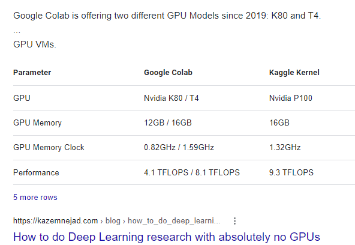

# Comparisons of GPU speeds  

# GPU speed, June 23/2022

Asus ROG Strix G17 is faster, by 2X, than Google Colab GPU free processor K80!  

Chollet chp12 p1 text generation notebook.  
ROG G17: Took 5 hours with 200 epochs, 90 sec/epoch, then down to 84 sec towards end.  
Colab GPU: only run 40 epochs. 164 sec/epoch. 
Also Colab simply will not run, download data, during the day.  Congestion.  
So could not have run this on Colab at all, if only daytime hours were available. 
Running timing test at night 11:40 pm EST, 6/23/2022.  

Really glad I bought a GPU laptop. RTX 3070 is only a few percent slower than 3080 or 3080 Super, 
due to temperature and power issues.  But is much faster than RTX 3060.  Sweet spot.  

On ROG G17, 96% of 16GB RAM was used during training.  Could possibly increase it to 32GB?   
(Asus Vivobook, upgraded to 32GB RAM when battery was upgraded. Don't see any change yet, maybe photos?)
ROG G17 VRAM is only 8GB. But is faster clock speed, DDR6 instead of 4.  

May or may not help with training speed. Colab has plenty of RAM but is slower to train.  
Colab using 40-60% of GPU Ram 12GB/16GB 
Colab 2GB/12GB system Ram
Colab 40GB/78GB storage disc using 

===  

> <b>Using GPU</b>  
> As of October 13, 2018, Google Colab provides a single 12GB NVIDIA Tesla K80 GPU that can be used up to 12 hours continuously. Recently, Colab also started offering free TPU.  
> As of August 6, 2022, Colab provides in the free tier K80, and a limited time on T4.  T4 has 16GB VRAM (vs 8GB) and is twice as fast as K80.  

2024 June T4 is minimum now? Yes, verified August 19, 2024. Only T4 is GPU free option, also TPUv2 free option.  
No longer K80 free tier. So will be same as my ROG computer.  

Asus ROG laptop similar to T4 speeds on LLM.  

