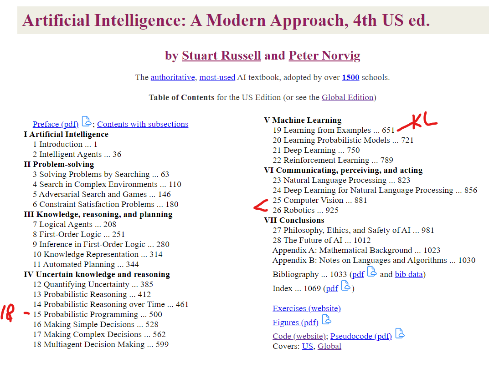
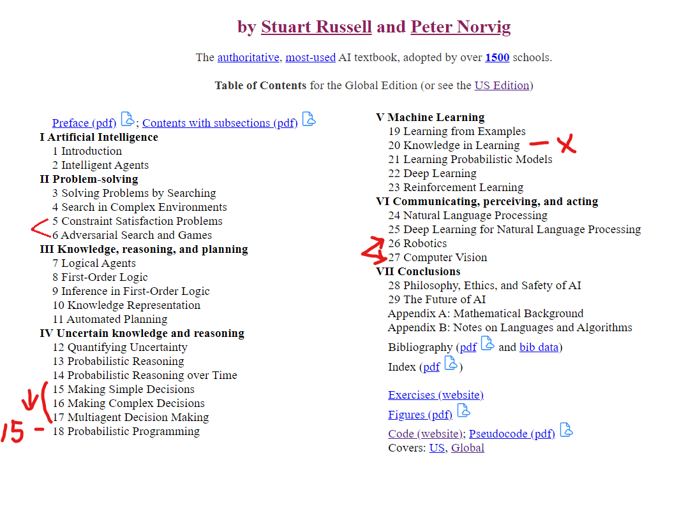

# Artifical Intelligence: a Modern Apprach, 4th ed.  

Book website: http://aima.cs.berkeley.edu/
Github python code: https://github.com/aimacode/aima-python

### TOC US version:  

### TOC Global version:  
A few chapters out of order.  1 new chapter.  
Was printed several months after US version.  
I have this version  

