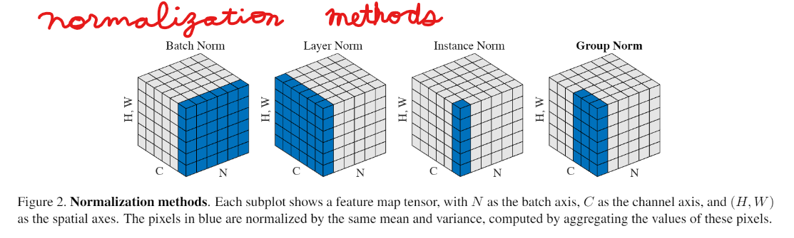

Chapter 7, 8 notes.  

### Keras dive chp 7  

Some basics covered in chp 4. Not explained there. Sequential model, fit().
Other types of architecture here. Explanations some.  

 * To run code later.  

### CNN vision chp 8  

Straight up CNN transfer learning.  
Fit 1 cycle  
Just like Fastai class.  

### Chp 9 goes into visualization of middle layers, callbacks, tensor board.  
Different architectures then Sequential. Customizing a training loop.  
Has 3 parts. Do only one chapter next.  
 * Part 3 all channels visualiztion, cat exampe, to study more. Best part. 
 * Chp 14 Conclusion nb has summary code for models DenseLayer, CNN, RNN, Transformer.  
 * Transformer uses fully connected layers modified by attention weights, layerwise weights or batchwise weights, skip connections and residual feedback. Inherent parallelization.  

Visualization of feature channels useful.  

Depthwise separable - good for feature channels but not RGB color channels, which are correlated.  
Feature channels assu,pmed to be uncorrelated.  

GATO - feature channels of image and label text start out uncorrelated, orthogonal, but as it trains, there is feedback and encoding space no longer uncorrelated between images and text channels.  

#### Nov 20, 2022 - to run code before small group meetup.  

See paper [Group Normalization Methods] in folder, on various normalization methods:    

### chp 9 talk document  

https://github.com/JennEYoon/deep-learning/blob/main/chollet2/chp7_8_9/chp9_meetup_talk_jyoon.docx

DSML Meetup, April 11, 2023, Chollet chp 9.1-9.3

Question from:  Mattew Kehoe
https://github.com/matthewshawnkehoe/deep-learning-with-python-notebooks

Mattew demoed running code, downloading tar files on Colab Unix setup.  
