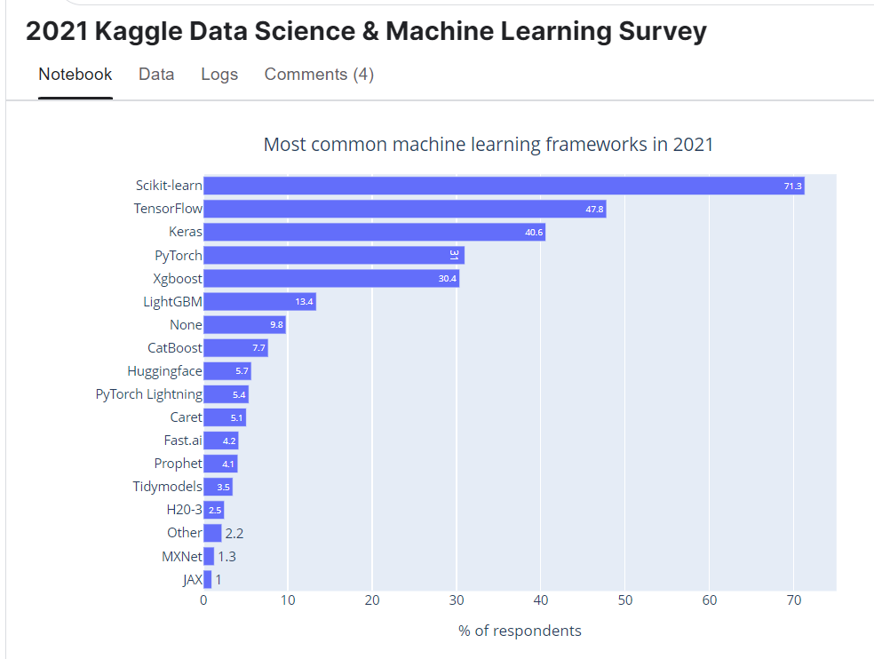

# Study notes for Deep Learning with Python, 2nd edition, 2021 c.  

#### 9/29/2021 Meetup Small Group:  

 * Decided to study this book next.  Chp 1 & 2 for ***October 25, 2021*** meeting, Monday 7pm.  
 * Chp 1 - overview
   - charts not update from 2017.  To message author about this.  
   - Most Used Library - updated to 2020 Kaggle DS User Survey. Other chart still not updated from 2017. 

   - A different 2020 Kaggle <u>winners'</u> survey was 70% PyTorch and 30% Tensorflow for deep learning projects.  

   - Scikit-Learn was number 1, library in Kaggle users' survey, by a large margin. This is not for deep learning.

   - https://www.kaggle.com/paultimothymooney/2021-kaggle-data-science-machine-learning-survey  
      - It's user's survey, NOT deep learning winner's main libraries used.  
      - Can dive into it, enter Kaggle Challenge for a prize?? 
      - More than 50% of respondents are students, and more than 70%? or respondents are foreigners.  
      - Not very good to go by this survey, some 14% of respondents have never coded or used a ML model!  
      - At least filter out all irrelevant respondents. Use only those with 1+ years of coding and ML experience, and from US and Canada.  India we know if very different market from US, with far more students and much younger in age.  
      - PyTorch used by 31%, Tensorflow by 48%, and Scikit-Learn by 71% of Kaggle Users (not winners, not deep learning only).    
         
     >  
      
   - Compare with 1st ed? 
   - 10/29/2021 TH - finished reading 5am 
   - 10/29/2021 TH 1.5h read Kaggle 2021 DS/ML User Survey, make notes. 

 * Chp 2 - more detailed math for NN, CNN, MNIST example than Fastai book.  
   - compare with fastai book presentations in chp 17 NN and chp 13 CNN.  
   - mostly finished reading 10/29/2021 TH 5 am, to reveiw details 1-layer chart and code, p 72-82.  
   - Need to review again before today's call.  1-layer example  
   - Later -- NVIDIA version of fully connected layer explanation, read and try code.  Good fit since both are TensorFlow.  
   - ---  
   - not as detailed as fastai chp17, to do fastai chp17 anyway, to reproduce everything with Numpy.  
   - code notebook is quite long, mnist example. Try running all, not necessarily tomorrow.    
   - but chp 3 has Keras code intro, tensor intro.  
 * v7 MEAP as of today, Nov 2021 est publication date.  

#### Dec 6, 2021 small group:  
Chp 3 today.  
Intro to Keras, some code.  Read first, then try running Tensorflow code.  

#### May and June 2022 small group, chp 11 Transformers.  

Still have difficulty understanding Transformers.  
Review keras code again, final 2 code segments of seq-to-seq part.
Youtube videos gave a better wholestic answer.  

 * 6/8/2020 - buy GPU laptop, spend most of the month setting up environments, tuning laptop settings, installing apps.  
  * 7/2/2022 - buy older phone 4G. 5G is a scam started by China Huawei, not needed in cell phones, was intended for commercial use, but requires 5x electricity consumption for towers.  Chinese telecom turns off towers to save electricity, upgrades users and apcharge 20x cost per usage. Throttle down 4G speeds by turning off towers, delete 4G cellphone plans.  Even in US, 5G is not needed, 4G is fast enough to download videos. Use wifi, much cheaper, for downloading videos.  

#### July 6, 2022 small group, chp 12 p1-3:  

Chp 12, p1 text-gen, 200 epochs takes 5h to train on ROG-G17 computer,  
86-90 s/epoch  
Takes 2X as long on Colab GPU. Only tried 40 epochs, took 2 hours. 
165 s/epoch.  

Even after all that, generated text were mostly gibberish.  Has some semblance of correct word order and noun and verb and adjectives, but movie reviews did not have any coherent meaning.  Source movie reviews were all well written and coherent. Computer does not understanding meaning. It's just putting together random words based on parts of speech and based on statistical occurrence in movie reviews.  

#### June 26/2022 notes:  
Chp 2, 3, and 9 will be good to review, to get better as using Keras as tool, intermediate values extract, visualize intermediate steps.  

After finishing chps 12, 13, and 14 with small group, suggest go back to chps 5 - 9.  
We did chp 10, but I didn't get much out of it at the time.  Maybe it will make more sense later, after doing chp 11 and 12.  
YouTube videos had good explanation of concept of Transformers and NLP generally.  https://youtu.be/rURRYI66E54  ComputerPhile  

#### 7/5/2022 notes: 
chp 2, 3, 7 keras, 9 adv CNN & visualizing steps.  
Do for review.  
 * Chp 12 Autoencoders, GANs in August 1, Monday.  
   - main parts will be done after August 2022.  
   
Started book with small group in October 29, 2021, so ~1 year to finish all interesting parts.  
Can't run my own code, but can use provided code with my own data substitution, understand at a general level how main models works.  

Next step is not to understand each model better as presented, but to start my own projects and go a lot deeper into one or two projects.  

### July 6 small group notes:  
 * Aug 1, 2023 - ch 12 sect 4 Autoencoders, 5 GAN
 * Sept - ch 7 Keras deep dive  
 * next ch 8 images cnn review, ch 9 callbacks, interpretation  
 * next ch 14 conclusion, future of deep learning.  
Youtube videos gave much better explanation of concepts in transformers, language models, attention, deep dream, style transfers, text generation (word level) vs sentence level? PaLM Pathways papaer.  

### 8/1/2022 meeting:  
Finished up chp 12 parts 4 and 5.  
Dan only, Peter coudn't make it.  
Sept -- go back to Chp 5 and 6.  Then complete to chp 9.  
Me - read on to chp 13 hyperparameters, ensemble models.  

