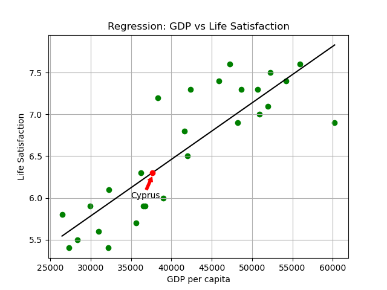

# Study notes, Hands on Machine Learning, 3rd ed, 2022 Oct, A. Gerone  

### Feb 2023 notes:  

Review table of contents, end of book notes, prefaces.  
Review online nbs, linear algebra, auto-diff partial differential equations.  
Look over chp 1, 2 nb. 

Has good updated chapters on generative models, diffusion models, Pathways, GATO, Flamingo - brief discussions.  

Edits for fork does not count towards github commit squares.  

### Feb 15, 2023:  
Chp 1  
Interesting use of text in plots. Try looping through highlighted countries to assign different markers and colors to each country. Practice plotting.  
Regression, makes several lines. Try doing regression calculation by hand. Recall formula. R-squared and adjusted-R-squared.  

Do full notebook. Create a similar notebook using energy consumption per capita and GDP. Try life satisfactiin vs energy consumption. Is energy consumption a good proxy for GDP?  Corralation of energy consumption and GDP.  

Data is for 2015. Stored in github.com/ageron/data repo.  
Re-run. Get data for other periods. See if the slope has changed over time.  Will it be accurate to say there are 2 or 3 curves? Middle income countries and lower and upper income countries?  Or authoritatian and democracies? Make graphs for different periods. Compare time periods.  

Source: https://www.oecdbetterlifeindex.org  
Better Life Index, 100,000 users volunteer, not statistically random sampling.  

Source:  https://ourworldindata.org  
World Bank, GDP/Capita

Matplotlib code is interesting. Try memorizing these.  
Outlier in high life satisfaction but lower GDP per capita is Isreal.  
US is outlier in lower satisfaction for higher GDP per capita.  
All 2015 data in USD.  

Country     GDP/Capita  Life-Sat
Isreal      $38,341     7.2

Russia      26,456      5.8  
Greece      27,287      5.4  
Turkey      28,384      5.5  
Hungary     31,007      5.6  
Portugal    32,181      5.4  

### 2/23/2023 7am, Chp 1:  
Stop p 25 Chp 1.  
Saved Figure, matplotlib pyplot  
plt.savefig('filename', format='png')
Must be executed in the same cell as when figure is plotted, in memory.  
Jupyter nb clears memory in next cell, so if gone.  

 * Next, try instance based learning, k-nearest neighbor clustering.  
 * More practice with drawing arrow in Matplotlib, LaTex mu and signa (r'$\mu=x, sigma=y\$') ?  
 * Try adding a photo or png plot to jupyter notebook.  

