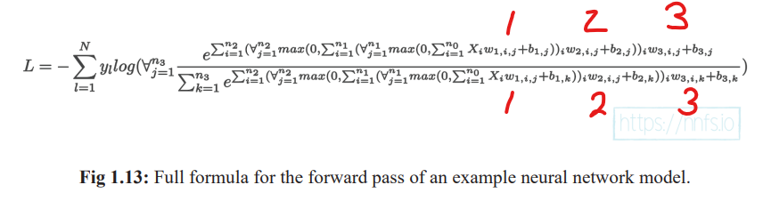

# Chapter 1 notes, nnfs  

Math and Python code for neural network forward pass, 3 layers example.  

#### A math representation of 3-layer forward pass, with several nodes per layer.  
  

#### Corresponding Python code  
Nested math operations, each layer is summed across number of nodes in the layer.    
  

NumPy functions used:  

np.T -- transpose
np.dot -- matrix dot product  
np.log -- natural log  
np.exp -- math e (anti-log)   